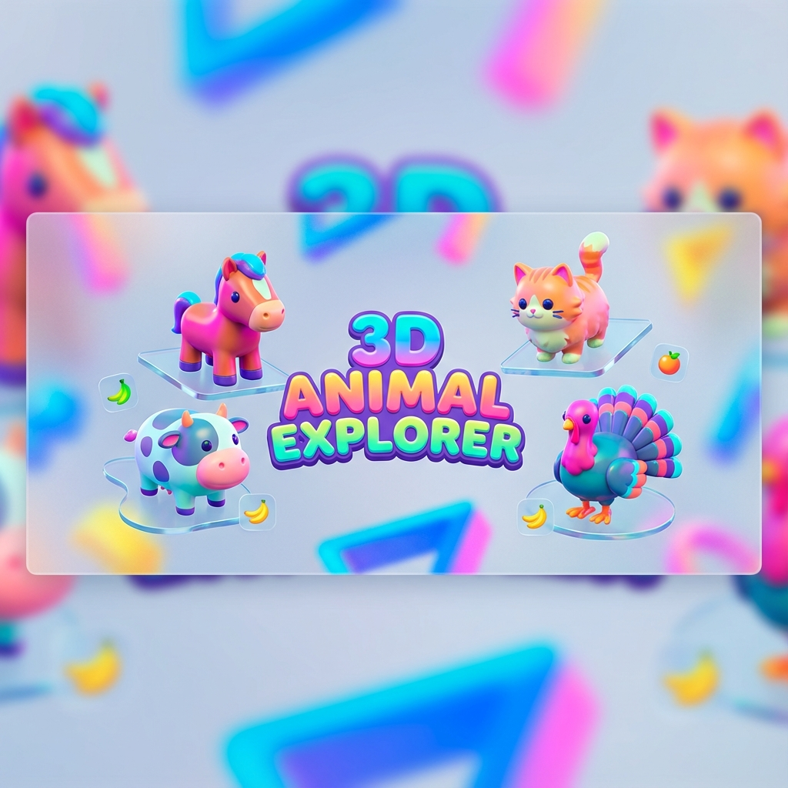

# 🐎 🐄 3D Animal Explorer 🐈 🦃

**A high-performance, mobile-first interactive 3D anatomy explorer.**



## 📖 Overview

**3D Animal Explorer** is an educational web application that allows users to interactively explore the anatomy of four different animals: **Horse**, **Cow**, **Cat**, and **Turkey**.

Built with modern web technologies, it focuses on **performance**, **accessibility**, and a **premium user experience** across all devices, from desktop monitors to mobile phones.

## ✨ Key Features

### 🚀 Performance & Tech
*   **`<model-viewer>` Core**: Utilizes Google's powerful web component for realistic, physically-based rendering.
*   **Adaptive Loading**: Automatically detects mobile devices and serves optimized, lightweight 3D models (Draco compressed) for instant loading.
*   **PWA Support**: Fully offline-capable thanks to a custom Service Worker. Install it on your phone for a native app-like experience.
*   **Zero Dependencies**: Built with Vanilla JavaScript and CSS for maximum speed and minimal bloat.

### 📱 Mobile-First Experience
*   **Touch-Optimized**: Large touch targets, swipeable bottom sheets, and gesture controls.
*   **Responsive Design**: Fluid layouts that adapt to portrait, landscape, and notched screens (Safe Area support).
*   **Haptic Feedback**: Subtle vibration feedback on interactions (where supported).

### 🎨 Visuals & Interaction
*   **Interactive Hotspots**: Click/tap on specific body parts to reveal detailed anatomical information.
*   **Glassmorphism UI**: Modern, sleek interface with frosted glass effects.
*   **Dark/Light Mode**: Fully supported theming.
*   **AR Ready**: View models in your real-world space using WebXR (Android/iOS).

## 🛠️ Installation & Usage

### Running Locally

1.  **Clone the repository**:
    ```bash
    git clone https://github.com/steven-amin02/3D-Animal-Explorer.git
    cd 3D-Animal-Explorer
    ```

2.  **Serve the files**:
    Because of CORS security policies, you cannot simply open `index.html` directly. You must use a local server.
    
    *   **VS Code**: Install the "Live Server" extension and click "Go Live".
    *   **Python**: `python -m http.server 8000`
    *   **Node**: `npx serve .`

3.  **Open in Browser**:
    Navigate to `http://localhost:8000` (or the port shown by your server).

### 📱 Mobile Usage

1.  Open the site on your mobile browser.
2.  **Add to Home Screen**: Tap "Share" (iOS) or the Menu (Android) and select "Add to Home Screen".
3.  Launch the app from your home screen for a full-screen, immersive experience.

## 📂 Project Structure

```
3D-Animal-Explorer/
├── index.html       # Main application structure
├── style.css        # All styling (Responsive, Glassmorphism)
├── script.js        # Core logic (State, Events, Adaptive Loading)
├── sw.js            # Service Worker for Offline Support
├── models/          # 3D Assets
│   ├── Horse.glb    # High-quality Desktop models
│   ├── Horse_mobile.glb # Draco-compressed Mobile models
│   └── ...
└── README.md        # This file
```

## 🤝 Contributing

Contributions are welcome! Please feel free to submit a Pull Request.

1.  Fork the project
2.  Create your feature branch (`git checkout -b feature/AmazingFeature`)
3.  Commit your changes (`git commit -m 'Add some AmazingFeature'`)
4.  Push to the branch (`git push origin feature/AmazingFeature`)
5.  Open a Pull Request

## 📄 License

Distributed under the MIT License. See `LICENSE` for more information.

---
*Built by Steven Amin*
